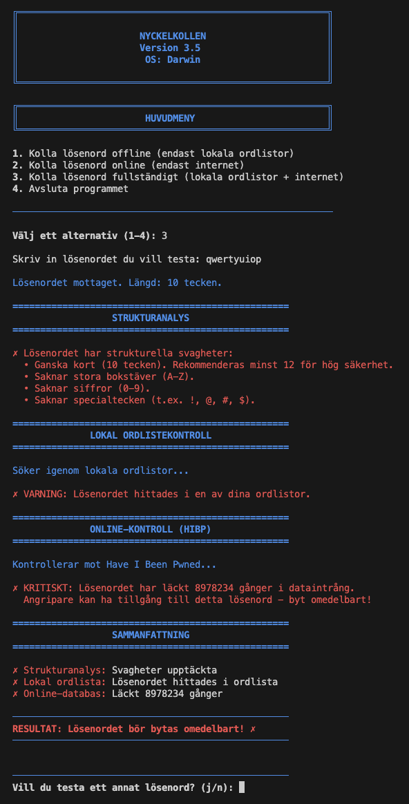

# Nyckelkollen

Välkommen till **Nyckelkollen** – ett säkerhetsverktyg utvecklat i Python för att utvärdera lösenordssäkerhet. Syftet med projektet är att ge användaren en tydlig bild av lösenordets kvalitet genom att kombinera teknisk analys med sökningar i databaser över kända dataintrång.

## Funktioner

Programmet utför flera tester för att säkerställa att lösenordet håller hög säkerhet:

1. **Analys av lösenordsstyrka:** Verktyget granskar om lösenordet uppfyller viktiga säkerhetskrav såsom längd (minst 12 tecken rekommenderas), användning av siffror, specialtecken och blandade stora/små bokstäver.

2. **Sökning i lokala ordlistor:** Kontrollerar om lösenordet finns med i vanliga listor över svaga lösenord (t.ex. `rockyou.txt`) som ligger i mappen `ordlistor`.

3. **Kontroll mot dataläckor (HIBP):** Använder API:et från *Have I Been Pwned* för att se om lösenordet har läckt ut i kända dataintrång. Sökningen sker säkert med k-anonymitet – endast de första 5 tecknen av lösenordets hash skickas, så ditt faktiska lösenord exponeras aldrig.

4. **Loggning:** Alla sökningar och resultat sparas automatiskt i `nyckelkollen.log` för historik och felsökning.

## Systemkrav

För att kunna använda verktyget behöver du:

* **Python 3** (version 3.6 eller senare)
* **Internetuppkoppling** (krävs för online-kontroller)
* **Skrivrättigheter** i mappen där programmet körs (för loggfilen)
* En mapp namngiven `ordlistor` i samma katalog (om du vill använda funktionen för lokala sökningar)

## Installation och användning

### 1. Hämta koden

Öppna din terminal och klona repositoryt:

```bash
git clone https://github.com/maxlaxen/script.git
```

### 2. Navigera till rätt mapp

```bash
cd script/Nyckelkollen
```

### 3. Förberedelser (valfritt)

Om du vill använda funktionen för lokal sökning:
- Skapa mappen `ordlistor` om den inte finns
- Placera dina ordlistor (t.ex. `rockyou.txt`) i mappen `ordlistor`

## Användning

### Starta programmet

Kör scriptet med Python 3:

```bash
python3 nyckelkollen.py
```

### Menyalternativ

När programmet startar presenteras en meny med följande alternativ:

1. **Offline-kontroll** – Endast lokala ordlistor
2. **Online-kontroll** – Endast Have I Been Pwned
3. **Fullständig kontroll** – Både lokala ordlistor och online-databaser
4. **Avsluta**

### Kommandoradsflaggor

* `-h` eller `--help` – Visar hjälpmeny med exempel på användning
* `-v` eller `--version` – Visar aktuell versionsinformation

**Exempel:**
```bash
python3 nyckelkollen.py --version
```

## Demonstration

Här är ett exempel där skriptet testar lösenordet `qwertyuiop` mot ordlistan `rockyou.txt` med alternativ 3 (fullständig kontroll):



*Skärmdumpen visar hur programmet analyserar lösenordet och kontrollerar det mot både lokala ordlistor och Have I Been Pwned.*

## Säkerhet

* Lösenord skickas **aldrig** i klartext över internet
* HIBP-kontrollen använder k-anonymitet (endast 5 första tecken av SHA-1-hashen skickas)
* Loggfilen sparar endast lösenordslängd, inte själva lösenordet

## Roadmap

Planerade funktioner för framtida versioner:

#### Lösenordsgenerator
En funktion som skapar säkra lösenord med anpassningsbar längd och teckentyper. Lösenordet kopieras automatiskt till urklipp för enkel användning.

#### GUI (Grafiskt gränssnitt)
Ett fönsterbaserat gränssnitt med knappar som alternativ till terminalen. Resultaten visas med färgkoder (grön/gul/röd) för tydligare översikt.

#### Batch-kontroll (Fil-import)
Möjlighet att ladda upp en fil med flera lösenord och testa alla samtidigt. Resultaten kan exporteras som en rapport i PDF eller CSV-format.

## Filstruktur
```
Nyckelkollen/
├── nyckelkollen.py      # Huvudprogrammet
├── ordlistor/           # Mapp för lokala lösenordslistor (valfritt)
│   └── rockyou.txt      # Exempel på ordlista
├── bilder/              # Skärmdumpar och illustrationer
│   └── demo.png         # Demonstration av programmet
├── Flowchart.png        # Visuellt flödesschema över programlogiken
├── README.md            # Denna fil
└── nyckelkollen.log     # Loggfil (skapas automatiskt vid körning)
```

## Bidra
Hittar du buggar eller har förslag på förbättringar? Skapa gärna en issue eller pull request på GitHub!

*Projektet är öppen källkod och fritt att använda.*